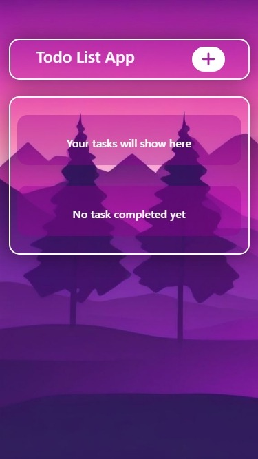
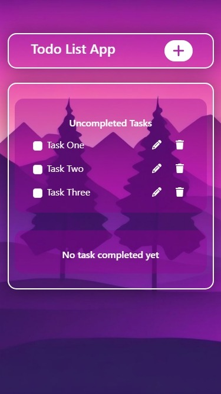
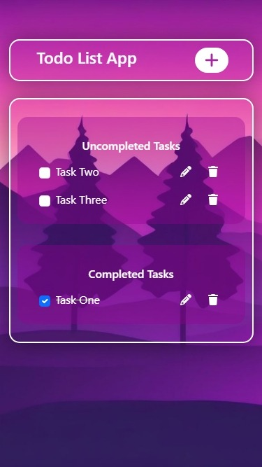

# To-Do List App in React JS

## Overview

This project is part of the Codevixens Frontend Development Challenge (Day 7). A simple to-do list application built using React. It demonstrates how to manage state, handle events, and render lists dynamically.

## Features

- **State Management**: Uses React's `useState` hook to manage the input value, the list of to-do items, and the status of each item.
- **Event Handling**: Handles the button click event to add new to-do items, and events for marking items as completed, editing items, and deleting items.
- **List Rendering**: Dynamically renders the list of to-do items using the `map` function.
- **User Interface**: Provides a form for adding new to-do items, a list to display the items, and buttons for marking items as completed and deleting them.
- **Styling**: Uses CSS to style the application for a visually appealing look.

## Installation

1. Clone the repository:

```bash
git clone https://github.com/gideonagyage/To-Do-List-App.git
```

2. Navigate to the project directory:

```bash
cd To-Do-List-App
```

3. Install dependencies:

```bash
npm install
```

## Usage

1. Start the development server:

```bash
npm start
```

2. Open your browser and navigate to

```bash
http://localhost:3000.
```

## How it Works

The `TodoListApp` component is the main component that handles the following:

1. **Input Handling**: Manages the user's input for new to-do items.
2. **State Updates**: Updates the state with the new to-do item, the status of each item, and the list of items.
3. **Event Handling**: Handles the button click event to add new to-do items, and events for marking items as completed and deleting items.
4. **List Rendering**: Renders the list of to-do items dynamically using the `map` function.
5. **UI Rendering**: Renders the input field, button, to-do list, and buttons for marking items as completed and deleting them.

## Screenshots

- Before Adding Task



- After Adding Task



- Completing Task



<br>

## Live Demo

Check out the live demo [here](https://to-do-list-app-coral-pi.vercel.app/).

## Key Concepts

1. **State Management**: Managing the data and UI state of the React application.
2. **Event Handling**: Responding to user interactions with the application.
3. **List Rendering**: Dynamically rendering lists of data in the React application.

## Contributing

Feel free to fork this repository and submit pull requests. Any contributions are welcome!

## License

This project is licensed under the MIT License.

## Acknowledgements

- Codevixens for organizing the challenge.
- Chinaza Igboanugo, Lois Bassey, and Oyinkansola Shoroye for their contributions and guidance.

Feel free to customize it further to fit your needs! If you have any specific details you'd like to add or change, let me know.
